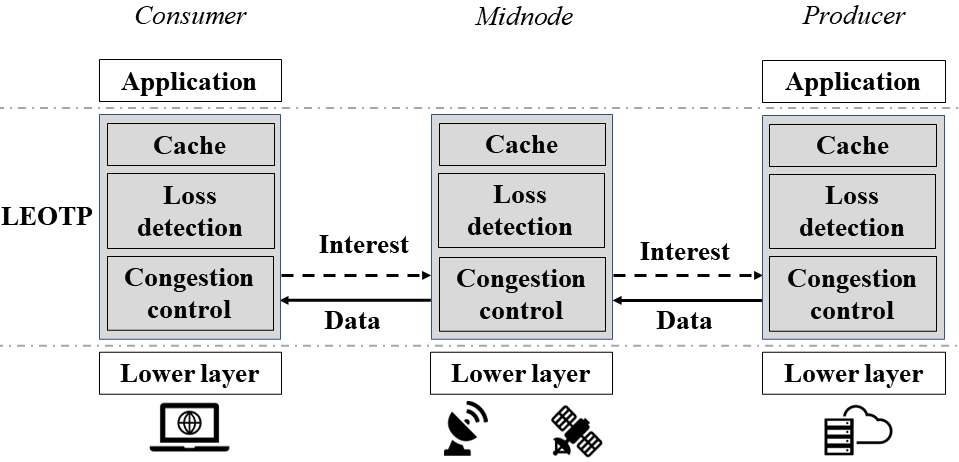
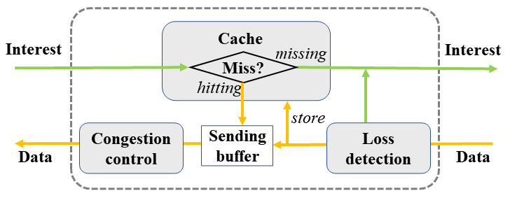
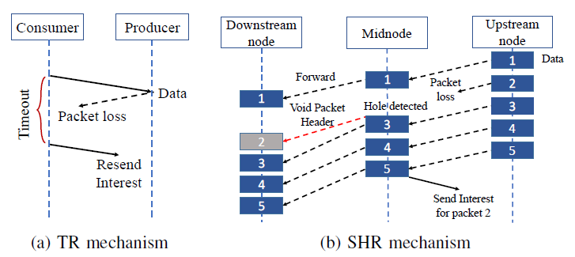
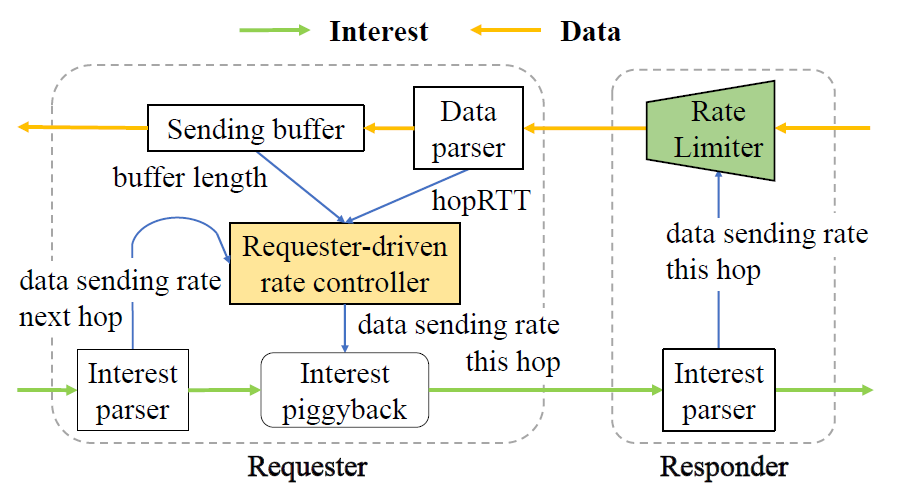

# 
 LEOTP: An Information-centric Transport Layer Protocol for LEO Satellite Networks 

 Li Jianga, Yihang Zhanga, Jinyu Yina, Xinggong Zhanga, Bin Liub 

 a Wangxuan Institute of Computer Technology, Peking University, Beijing, China 

 b Department of Computer Science and Technology, Tsinghua University, Beijing, China 

 <b> ICDCS 2023 </b> 

## Abstract 

Low Earth orbit (LEO) satellite networks have attracted extensive research due to their potential to provide high-quality Internet access services. However, the existing TCP variants, which are designed for terrestrial networks, can hardly work in LEO satellite networks with characteristics such as error-prone, bandwidth variations, and link switching. To address these challenges, in this paper we present a new information-centric transport layer protocol LEOTP to guarantee reliable, high-throughput, and low-latency data transmission in LEO satellite networks. It leverages the idea of Information-Centric Networking (ICN) with a Request-Response transmission model and in-network caching. The connectionless transmission paradigm in LEOTP makes it resilient to dynamic topology changes. The caches equipped in intermediate nodes help to recover packet loss while the hop-by-hop congestion control mechanism provides a fast reaction to time-varying network conditions. We evaluate the performance of LEOTP in emulated Starlink constellation, which shows that it increases the throughput by 8%-12% with 40%-60% delay reduction compared with the state-of-the-art TCP variants in the transcontinental data transmission.

## Code

<!--
Will be published soon.
-->

This is the code for LEOTP. [[code]](https://github.com/jl99888/LEOTP)

## Paper

<!--
Will be published soon.
-->

[[camera-ready version paper]](./LEOTP_icdcs.pdf)

## Slides

Will be published soon.

<!--
[[slides]](./LEOTP_ICDCS_pre.pdf)
-->

## Figures

<table>
    <tr>
        <td>
Fig. 6: The overview of LEOTP architecture.
</td>
        <td>
Fig. 7: The key modules in a Midnode.
</td>
    </tr>
    <tr>
        <td>
Fig. 8: The hybrid retransmission mechanism.
</td>
        <td >
Fig. 9: Congestion control in one hop.
 </td>
    </tr>
</table>

## Comparisions

Fig. 10:The distribution of the retransmitted packets’ OWD in lossy link.        [[Data]](./logs/retran_delay_test)

Fig. 11: The relation of loss rate and the traffic sent by sender for an 100MB file.        [[Data]](./logs/retran_traffic_test)

Fig. 12: The relation of loss rate and throughput.        [[Data]](./logs/loss_test)

Fig. 13: The relation of topology change frequency and throughput.        [[Data]](./logs/link_switch_test)

Fig. 14: Throughput-OWD trade-off under bandwidth fluctuations.         [[Data]](./logs/bandwidht_fluctuation_test)

Fig. 15: Intra-protocol fairness under same RTT and different RTT.        [[same RTT]](./logs/fairness_same_rtt)    [[different RTT]](./logs/fairness_diff_rtt)

Fig. 16: Cumulative distribution graph of OWD and throughput in Beijing-Shanghai link without ISLs.    [[Data]](./logs/starlink_without_isl)

Fig. 17: Cumulative distribution graph of OWD and throughput in Beijing-New York link with ISLs.        [[Data]](./logs/starlink_with_isl)

Fig. 18: Average OWD and throughput in different city pair links with ISLs.        [[Data]](./logs/starlink_with_isl)

TABLE II: The result of the ablation experiment.        [[Data]](./logs/ablation_test)

## More works from our lab

[[Netvideo group]](https://www.icst.pku.edu.cn/NetVideo/)
